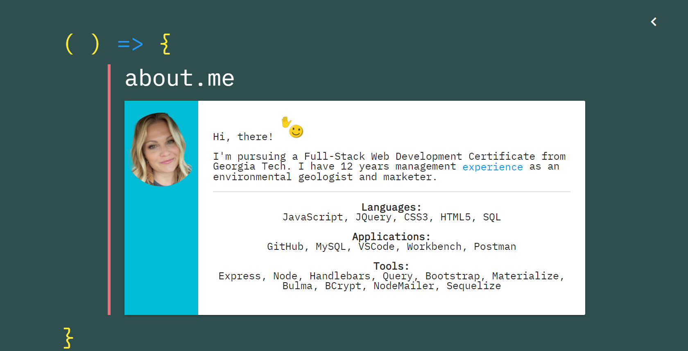

# Professional-Portfolio

My professional web development portfolio including samples of selected work, about me, and contact information.

## Licensing:

## Table of Contents

- [Usage](#Usage)
- [Technologies](#Technologies)
- [Contact](#Contact)
- [Links](#Links)

## Usage

_Homepage:_

_Homepage w/ sidenav:_

_Mobile Homepage:_

_About Me:_

_Work:_

_Mobile Work:_

_Contact Me:_

## Technologies

- JavaScript
- Node.js
- Express.js
- Materialize

## Contact

- https://github.com/merewall

## Links

- [Deployed application](https://meredithwall.herokuapp.com/)
- [GitHub Repo](https://github.com/merewall/Professional-Portfolio)
